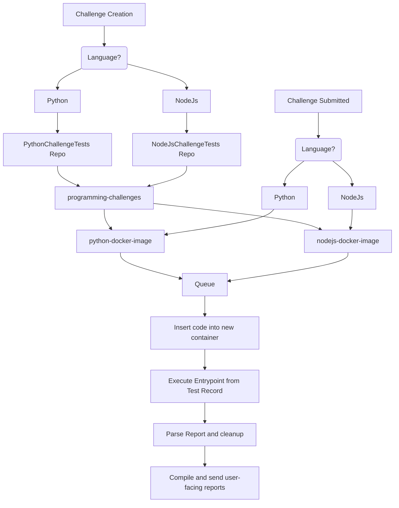
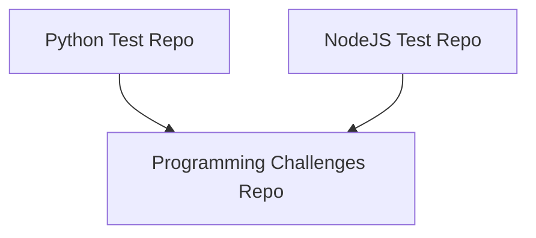

# Overview

The challenge service is the most complex service we offer. It has a lot of moving parts.

For each language we want to support, they are added as submodules in the `Programming Challenges` Repo. Through CI/CD we can automate building and pushing docker images for each module!

## What is a challenge?
A [challenge](https://github.com/Programming-Simplified-Community/CommunityBot/blob/main/Data/Challenges/ProgrammingChallenge.cs#L8-L37) represents what we want from our users. Explains the specifications that they must meet.

## Tests
It is important that the tests we create match our challenge specifications verbatim! We must be fair to our users in that aspect.

In the database, we can [link](https://github.com/Programming-Simplified-Community/CommunityBot/blob/main/Data/Challenges/ProgrammingChallenge.cs#L39-L71) tests from our repos to a challenge!

Each test has an associated language, docker image, entrypoint, and starting file location. Helps us keep things flexible.